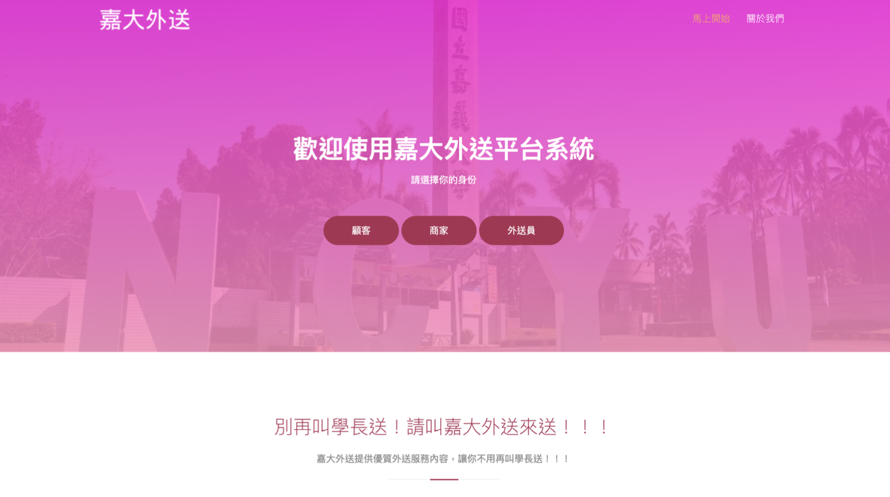

# DB_Final
資料庫系統設計-期末專題
## 嘉大外送平台系統
組員:李昱佑、謝孟澔 
學號:1094841、1094844 
開課老師:陳耀輝
### 摘要
#### 目的
* 飲食開銷為日常所需，但隨著生活更加忙碌，我們大學生有時會因為課業上的專題或著作業等問題，需要長時間專注在這上面，常常連買午餐、晚餐的時間都抽不出來。
* 我們希望透過打造一個外送平台系統，讓學生們只需要動動手指，按一按按鈕，就會有人幫你把餐點送達你所在的位置。除了讓學生們可以更加專注在課業上之外，同時也讓美食商家們獲得更好的業績。
#### 過程及方法
* 在這次專題當中，我們先設計出使用者介面以及所需要的功能後，再根據功能設計出相對應的資料庫分類和內容，接著將 table 進行正規化，避免設計不周全的錯誤。我們使用了 PHP、MySQL 與 phpMyAdmin 來實作此系統。
#### 結果
* 我們打造了嘉大外送平台系統，已經可以實現上架商品、下訂單、查看交易紀錄、查詢訂單狀態等功能。雖然只是一個簡單的平台，但我們已經實現了外送平台的基本功能了。
#### 使用技術
* PHP、MySQL
### DEMO影片
* 
### 詳細書面報告(含資料庫設計細節)
* [書面報告](written_report/資料庫系統設計＿期末專題報告.pdf)
